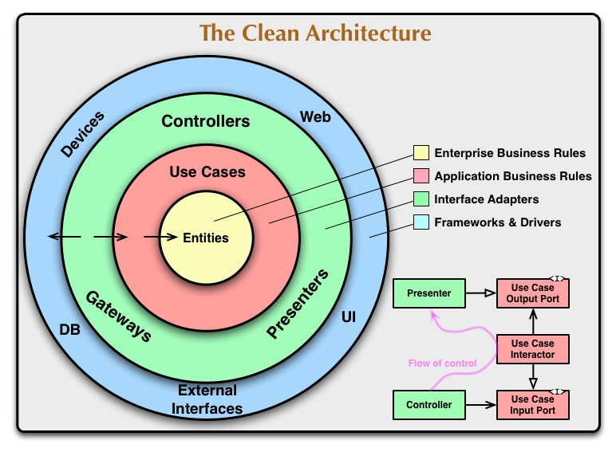
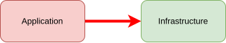

# Table of contents

1. [Overview](#overview)
2. [Architecture Principles](#architecture-principles)
    1. [Introduction](#introduction)
    2. [Layered Approach](#layered-approach)
    3. [Dependency Rule](#dependency-rule)
        1. [Note on Adapters](#note-on-adapters)
    4. [Dependency Inversion](#dependency-inversion)
    5. [Dependency Injection](#dependency-injection)
3. [Project](#project)
    1. [API](#api)
    2. [Architecture](#architecture)
    3. [Structure](#structure)
        1. [Scenarios?](#scenarios-which-layer-they-belong-to)
    4. [Technology Stack](#technology-stack)
    5. [Configuration](#configuration)
        1. [Flow](#flow)
        2. [Setup](#setup)
        3. [Launch](#launch)
4. [Acknowledgements](#acknowledgements)
5. [Todo](#todo)

# Overview

This FastAPI-based project and its documentation represent my interpretation of Clean Architecture principles with
subtle notes of Domain-Driven Design (DDD).
While not claiming originality or strict adherence to every aspect of these methodologies, the project demonstrates how
their key ideas can be effectively implemented in Python.

The vision behind the project was shaped with insights from the ASGI
Community [Telegram chat](https://t.me/fastapi_ru).
For a deeper understanding of the concepts applied here, the following resources are recommended:

- [Robert C. Martin. Clean Architecture: A Craftsman's Guide to Software Structure and Design. 2017](https://www.amazon.com/Clean-Architecture-Craftsmans-Software-Structure/dp/0134494164)

- [Vaughn Vernon. Implementing Domain-Driven Design. 2013](https://www.amazon.com/Implementing-Domain-Driven-Design-Vaughn-Vernon/dp/0321834577)

- [Alistair Cockburn. Hexagonal Architecture Explained. 2024](https://www.amazon.com/Hexagonal-Architecture-Explained-Alistair-Cockburn-ebook/dp/B0D4JQJ8KD)
  (introduced in 2005)

- [Eric Evans. Domain-Driven Design: Tackling Complexity in the Heart of Software. 2003](https://www.amazon.com/Domain-Driven-Design-Tackling-Complexity-Software/dp/0321125215)

- [Martin Fowler. Patterns of Enterprise Application Architecture. 2002](https://www.amazon.com/Patterns-Enterprise-Application-Architecture-Martin/dp/0321127420)

# Architecture Principles

## Introduction

This repository may be helpful for those seeking a backend implementation in Python that is both framework-agnostic
and storage-agnostic (unlike Django).
Such flexibility can be achieved by using a web framework that doesn't impose strict software design (like FastAPI) and
applying a layered architecture patterned after the one proposed by Robert Martin, which we'll explore further.

The original explanation of the Clean Architecture concepts can be
found [here](https://blog.cleancoder.com/uncle-bob/2012/08/13/the-clean-architecture.html).
If you're still wondering why Clean Architecture matters, read the article — it only takes about 5 minutes.
In essence, it’s about making your application independent of external systems and highly testable.

<p align="center">
  
  <br><em>Figure 1: <b>Robert Martin's</b> Clean Architecture Diagram</em>
</p>

> "A computer program is a detailed description of the **policy** by which inputs are transformed into outputs."
>
> — Robert Martin

The concentric circles represent boundaries separating layers, each with its own policies.
The less likely a policy is to change, and the more abstract and independent of implementation it is,
the closer it is to the center.
An example of the least abstract policy is an I/O operation.

The meaning of the arrows in the diagram will be discussed [later](#dependency-rule).
For now, we will focus on the purpose of the layers.

### Layered Approach

 **Domain Layer**

- This is the core of the business logic, defining the **ubiquitous language**, a consistent terminology shared across
  the application and business domain. This is the language you can speak with managers.
- It contains **entities, value objects, and domain services** that encapsulate critical business rules — rules that
  create product value independently of its software implementation.
- Fully isolated from external systems, the Domain layer remains the most stable and least prone to change.

> [!NOTE]
> The Domain layer may also include **aggregates** (groups of entities and value objects that set consistency
> boundaries) and **repository interfaces** (abstractions for storing and retrieving aggregates).
> These concepts aren't implemented in the project's codebase, but they're worth exploring to better understand DDD.

 **Application Layer**

- This layer bridges business requirements and implementation details.
- It defines and coordinates _**use cases**_ — high-level abstractions describing applied business scenarios.
  Each use case encapsulates rules and flows needed to achieve a business goal with respect to user interaction.
- The core component of this layer is the **interactor**, representing an individual step within a use case.
- Interactors _**orchestrate**_ business logic by applying domain rules and delegating tasks to domain entities and
  services.
  To access external systems, interactors use **interfaces (ports)**, which abstract infrastructure details.
- Interactors can be grouped into an **application service**, combining actions sharing a close context.

 **Infrastructure Layer**

- This layer is responsible for _**adapting**_ the application to external systems.
- It provides **implementations (adapters)** for the interfaces (ports) defined in the Application layer,
  enabling interaction with external systems like databases, APIs, and file systems while keeping the business
  logic isolated.
- Related adapter logic can also be grouped into an **infrastructure service** if justified.

 **Presentation Layer**

> [!NOTE]
> In the original diagram, the Presentation layer isn't distinguished and is included within the Interface
> Adapters layer. I introduce it as a separate layer, marked in blue, as I view it as even more external compared to
> typical adapters (see Figure 3).

- This layer handles external requests and includes **controllers** that validate inputs and pass them to the
  interactors in the Application layer. In the more abstract layers of the program, we assume that data has already been
  validated and won't cause the program to break, allowing us to focus solely on business logic.
- Controllers must be as thin as possible and ideally contain no logic beyond basic input validation and routing. Their
  role is strictly to act as a boundary between the application and external systems (e.g., FastAPI).

> [!IMPORTANT]
> - **_Basic_** validation (e.g., type safety, required fields, input format) should be performed by controllers at this
    layer, while **_business rule_** validation (e.g., ensuring the email domain is allowed, verifying the uniqueness of
    username, or checking that a user meets the required age) should be handled by the Domain layer.
> - In the Domain layer, validation often checks how multiple fields relate to each other. For example, ensuring that a
    discount applies only within a specific date range, or that a promotion code can only be used with orders above a
    certain total amount.
> - Pydantic is entirely useless in the Domain layer. Its parsing and serialization features have no relevance here, and
    while it might seem suitable for validation, its capabilities are limited to checks of individual fields, such as
    types and formats. Domain validation, on the other hand, requires enforcing complex relationships and
    business-specific rules, tasks that Pydantic cannot handle.

 **External Layer**

> [!NOTE]
> In the original diagram, the external components are included in the blue layer (Frameworks & Drivers).
> Here, I've marked them in gray to clearly separate them from the layers within the application's boundaries (see
> Figure 3).

- This layer represents fully external components such as web frameworks (e.g. FastAPI itself), databases, third-party
  APIs, and other services.
- These components operate outside the application’s core logic and can be easily replaced or modified without affecting
  the business rules, as interactions occur through the Presentation and Infrastructure layers.

> [!IMPORTANT]
> - Clean Architecture doesn't prescribe any particular number of layers.
    The key is to follow the Dependency Rule, which is explained in the next section.

## Dependency Rule

A dependency occurs when one software component relies on another to operate.
If you were to split all blocks of code into separate modules, dependencies would manifest as imports between those
modules. Typically, dependencies are graphically depicted in UML style in such a way that

> [!IMPORTANT]
> - `A -> B` (**A points to B**) means **A depends on B**.

The key principle of Clean Architecture is the **Dependency Rule**.
This rule states that **dependencies never point outwards** within the application's boundaries, meaning that the more
abstract layers of software must not depend on more concrete ones.

> [!IMPORTANT]
> - Components within the same layer can depend **on each other.** For example, components in the Infrastructure layer
    can interact with one another without crossing into other layers.
>
> - Components in any outer layer can depend on components in **any** inner layer, not necessarily the one closest to
    them. For example, components in the Presentation layer can directly depend on the Domain layer, bypassing the
    Application and Infrastructure layers.
>
> - However, avoid letting business logic leak into peripheral details, such as raising business-specific exceptions in
    the Infrastructure layer or enforcing domain rules outside the Domain layer.

### Note on Adapters

In my opinion, the diagram by R. Martin in Figure 1 can, without significant loss, be replaced by a more concise and
pragmatic one — where the adapter layer serves as a bridge, depending both on the internal layers of the application and
external components.
This adjustment implies **reversing** the arrow from the blue layer to the green layer.

The proposed solution is a **trade-off**.
It doesn't strictly follow R. Martin's original concept but avoids introducing excessive abstractions with
implementations outside the application's boundaries.
Pursuing purity on the outermost layer, as envisioned by R. Martin, is more likely to result in overengineering than in
practical gains.

My approach retains nearly all the advantages of Clean Architecture while simplifying real-world development.
When needed, adapters can be removed along with the external components they're written for, which isn't a
significant issue.

Let's agree, for this project, that Dependency Rule **does not apply to adapters**.

<p align="center">
  
  <br>
    <em>
    Figure 2: <b>Revised</b> Robert Martin's Clean Architecture Diagram.
    Note the inverted arrow from the outer layer
    </em>
</p>

<div style="display: grid; grid-template-columns: repeat(auto-fit, minmax(400px, 1fr)); gap: 10px; justify-items: center;">
  
  
</div>
<p align="center" style="font-size: 14px;">
  <em>Figure 3: <b>My Pragmatic Interpretation</b> of Clean Architecture Diagram<br>
  (original and alternative representation)
  </em>
</p>

<p align="center">
  
  <br><em>Figure 4: Basic Dependency Graph</em>
</p>

## Dependency Inversion

The **dependency inversion** technique enables reversing dependencies **by placing an interface** between the
components, allowing the inner layer to communicate with the outer while following the **Dependency Rule**.
This makes the outer layer a plugin to the inner layer.

<p align="center">
  
  <br><em>Figure 5: <b>Corrupted</b> Dependency</em>
</p>

In this example, the Application component depends directly on the Infrastructure one, violating the Dependency Rule.
This creates "corrupted" dependencies, where changes in the Infrastructure layer can propagate to and unintentionally
affect the Application layer.

<p align="center">
  
  <br><em>Figure 6: <b>Correct</b> Dependency</em>
</p>

In the correct design, the Application layer component depends on an **abstraction (port)**, and the Infrastructure
layer component **implements** the corresponding interface.
The Infrastructure component acts as an adapter to the port, maintaining separation of concerns and following the
**Dependency Inversion Principle (DIP)**.
This design ensures that the Application remains decoupled from the Infrastructure, allowing changes in the
Infrastructure layer with minimal impact on the core business logic.

## Dependency Injection

The idea behind **Dependency Injection** is that a component should not create the dependencies it needs, but rather
receive them from the outside.
From this definition, it's clear that the implementation of DI is often closely tied to the `__init__` method and
function signatures, where the required dependencies are passed in.

But how exactly should these dependencies be passed?

**DI frameworks** offer an elegant solution by automatically creating the necessary objects (while managing their
**lifecycle**) and injecting them where needed.
This makes the process of dependency injection much cleaner and easier to manage.

<p align="center">
  
  <br><em>Figure 7: <b>Correct</b> Dependency <b>with DI</b></em>
</p>

FastAPI includes a built-in **DI mechanism** called [Depends](https://fastapi.tiangolo.com/tutorial/dependencies/).
However, applications designed in line with Clean Architecture principles shouldn't be tightly coupled to any particular
web framework.
Since the web framework is the outermost layer of the application, it should be easily replaceable.
Refactoring the entire codebase to remove `Depends` if you switch frameworks is far from ideal.
It's much more convenient to have a **DI solution** that works with any web framework.
Personally, I prefer [**Dishka**](https://dishka.readthedocs.io/en/stable/index.html).

# Project

## Architecture

<p align="center">
  
  <br><em>Figure 8: Project architecture</em>
</p>

This diagram shows the architecture of the project, demonstrating how components interact in line with Clean
Architecture principles.
It illustrates how the **Dependency Rule** and **Dependency Inversion Principle** are applied to keep the core business
logic independent of external systems, while allowing flexible integration with infrastructure and external services.

## Structure

```
.
├── ...
├── .env.example    # example env vars for Docker/local dev
├── config.toml     # primary config file
├── Makefile        # shortcuts for setup and common tasks
├── pyproject.toml  # tooling and environment config
├── scripts/...     # helper scripts
└── src/
    └── app/
        ├── run.py              # app entry point
        ├── application/...     # Application layer
        ├── domain/...          # Domain layer
        ├── infrastructure/...  # Infrastructure layer
        ├── presentation/...    # Presentation layer
        ├── scenarios/...       # specific scenarios (e.g., create_user, log_in, etc.)
        └── setup/
            ├── app_factory.py  # app builder
            ├── config/...      # app settings
            └── ioc/...         # dependency injection setup
```

### Scenarios? Which layer they belong to?

<p align="center">
  
  <br><em>Figure 9: Scenarios</em>
</p>

What you see in `scenarios/` is the upper part of the project architecture [shown earlier](#architecture), organized
into vertical slices that combine components from the Presentation and Application layers.
Each slice reflects a specific task, such as `create_user` or `log_in`.
For me, this is simply a practical way to structure the project, not part of the architecture itself, though it does
resemble Robert Martin’s concept of _"screaming architecture"_.

If you don’t like this project organization, the modules from `scenarios/` can easily be moved to their respective
layers, such as Presentation or Application.

## Technology Stack

- **Python**: `3.12`
- **Core**: `alembic`, `alembic-postgresql-enum`, `bcrypt`, `dishka`, `fastapi`, `orjson`, `psycopg3[binary]`,
  `pydantic[email]`, `pyjwt[crypto]`, `rtoml`, `sqlalchemy[mypy]`, `uuid6`, `uvicorn`, `uvloop`
- **Testing**: `coverage`, `pytest`, `pytest-asyncio`
- **Development**: `bandit`, `black`, `isort`, `line-profiler`, `mypy`, `pre-commit`, `pylint`, `ruff`

## API

<p align="center">
  
  <br><em>Figure 10: Handlers</em>
</p>

### General

- `/`: Open to everyone.
    - Redirects to Swagger Documentation.
- `/api/v1/`: Open to everyone.
    - Returns `200 OK` if the API is alive.

### Auth (`/api/v1/auth`)

- `/signup`: Open to everyone.
    - Registers a new user with validation and uniqueness checks.
    - Passwords are peppered, salted, and stored as hashes.
    - A logged-in user cannot sign up until the session expires or is terminated.
- `/login`: Open to registered users.
    - Authenticates a user, sets a JWT access token with a session ID in cookies, and creates a session.
    - A logged-in user cannot log in again until the session expires or is terminated.
    - Authentication renews automatically when accessing protected routes before expiration.
    - If the JWT is invalid, expired, or the session is terminated, the user loses authentication.
- `/logout`: Open to authenticated users.
    - Logs the user out by deleting the JWT access token from cookies and removing the session from the database.

### Users (`/api/v1/users`)

- `/` (POST): Open to admins.
    - Creates a new user, including admins, if the username is unique.
- `/` (GET): Open to admins.
    - Retrieves a paginated list of existing users with relevant information.
- `/inactivate`: Open to admins.
    - Soft-deletes an existing user, making that user inactive.
- `/reactivate`: Open to admins.
    - Restores a previously soft-deleted user.
- `/grant`: Open to admins.
    - Grants admin rights to a specified user.
- `/revoke`: Open to admins.
    - Revokes admin rights from a specified user.

> [!NOTE]
> - Endpoints `/inactivate`, `/reactivate`, `/grant`, and `/revoke` are fully functional but should be reworked
    if the system requires superuser control.
    Currently, admins can manage other admins.
> - The initial admin privileges must be granted manually (e.g., directly in the database), though the user
    account itself can be created through the API.

## Configuration

### Flow

> [!WARNING]
> - This part of documentation is not related to the architecture approach.
    You are free to choose whether to use the proposed automatically generated configuration system or provide your own
    settings manually, which will require changes to the Docker configuration.
    **However, if settings are read from environment variables instead of `config.toml`, modifications to the
    application's settings code will be necessary.**


> [!IMPORTANT]
> - In the configuration flow diagram below,
    **the arrows represent the flow of data, not dependencies.**

<p align="center">
  
  <br><em>Figure 11: Configuration flow (.toml to .env)</em>
</p>

1. `config.toml`: primary config file
2. `.env`: derivative config file which Docker needs

<p align="center">
  
  <br><em>Figure 12: Configuration flow (app)</em>
</p>

### Setup

#### 1. Primary configuration

Edit the `config.toml` file to set up primary config.

> [!WARNING]
> **Don't rename existing variable names or remove comments** unless absolutely necessary. This action may invalidate
> scripts associated with the `Makefile`. You can still fix them or not use `Makefile` at all.

#### 2. Derivative configuration

Generate `.env` file **in one** of the ways:

1. **Safe**, as long as `config.toml` is correct
    - ```shell
      make dotenv
      ```

   > For this method you must manually set the correct value of `POSTGRES_HOST` variable in `config.toml`. Its value
   will be `localhost` for local launch, or the name of the **Docker service** from `docker-compose.yaml`.

2. **Less secure, but very convenient**
    - ```shell
      make dotenv-docker
      ```
   to prepare `.env` for Docker environment, or
    - ```shell
      make dotenv-local
      ```
   for local dev purposes, such as a locally hosted database.

   > Under the hood, the corresponding variable in `config.toml` becomes uncommented, then the script associated
   > with `make dotenv` is called.

3. **Unsafe**: Rename `.env.example` to `.env` and check if all variables are correct.

### Launch

#### Database only

One downside of this launch method is that it **automatically attempts to rewrite** `config.toml` **to create** `.env`.

- To run only the database in Docker and use the app locally, use the following command:

    - ```shell
      make up-local-db
      ```
- Then, apply the migrations with:

    - ```shell
      alembic upgrade head
      ``` 

  > After applying the migrations, you can start the application locally as usual.
  > The database is now set up and ready to be used by your local instance.

- To stop the database container, use:
    - ```shell
      make down
      ```

- To completely remove the database along with the applied migrations, run:

    - ```shell
      docker compose down -v
      ```

#### All containers

- After completing both steps in [Setup](#setup), you can launch all containers. **Choose one** of the following
  commands:

    - ```shell
      docker compose up --build
      ```

    - ```shell
      make up-echo
      ```

- To run containers in the background, **choose one** of the following commands:

    - ```shell
      docker compose up --build -d
      ```
    - ```shell
      make up
      ```

- To stop the containers, **choose one** of the following commands:

    - ```shell
      docker compose down
      ```

    - ```shell
      make down
      ```

Feel free to take a look at [`Makefile`](Makefile), it contains many more useful commands.

# Acknowledgements

I would like to express my sincere gratitude to the following individuals for their valuable ideas and support in
satisfying my curiosity throughout the development of this project:

- [igoryuha](https://github.com/igoryuha)
- [tishka17](https://github.com/tishka17)
- [Dark04072006](https://github.com/Dark04072006)
- [Sehat1137](https://github.com/Sehat1137)
- [PlzTrustMe](https://github.com/PlzTrustMe)
- [Krak3nDev](https://github.com/Krak3nDev)
- [Ivankirpichnikov](https://github.com/Ivankirpichnikov)
- [Lancetnik](https://github.com/Lancetnik)
- [nkhitrov](https://github.com/nkhitrov)

I would also like to thank all the other participants of the ASGI Community [Telegram chat](https://t.me/fastapi_ru) for
their insightful discussions and shared knowledge.

# Todo

- [ ] simplify the configuration
- [ ] switch from poetry to [uv](https://docs.astral.sh/uv/)
- [ ] explain the code in README
- [ ] increase test coverage and set up CI
