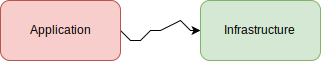
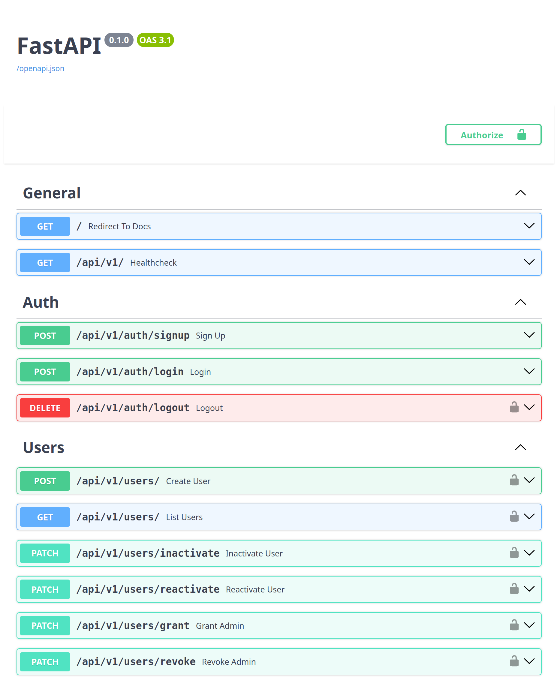

# Table of contents

1. [Overview](#overview)
2. [Architecture Principles](#architecture-principles)
    1. [Introduction](#introduction)
    2. [Layered Approach](#layered-approach)
    3. [Dependency Rule](#dependency-rule)
    4. [Dependency Inversion](#dependency-inversion)
    5. [Dependency Injection](#dependency-injection)
3. [Project](#project)
    1. [API](#api)
    2. [Architecture](#architecture)
    3. [Structure](#structure)
    4. [Technology Stack](#technology-stack)
    5. [Configuration](#configuration)
        1. [Flow](#flow)
        2. [Setup](#setup)
        3. [Launch](#launch)
4. [Acknowledgements](#acknowledgements)
5. [Todo](#todo)

## Overview

This FastAPI-based project and its documentation represent my interpretation of the Clean Architecture principles with
subtle notes of Domain-Driven Design (DDD). While not claiming originality or strict adherence to every aspect of these
methodologies, this project serves as a demonstration of how these concepts can be implemented in Python.

This vision has been shaped with insights from the [FastAPI Telegram chat](https://t.me/fastapi_ru).

For a deeper understanding of the principles and concepts used in this project, refer to the following resources:

- [Robert C. Martin. Clean Architecture: A Craftsman's Guide to Software Structure and Design. 2017](https://www.amazon.com/Clean-Architecture-Craftsmans-Software-Structure/dp/0134494164)

- [Vaughn Vernon. Implementing Domain-Driven Design. 2013](https://www.amazon.com/Implementing-Domain-Driven-Design-Vaughn-Vernon/dp/0321834577)

- [Alistair Cockburn. Hexagonal Architecture Explained. 2024](https://www.amazon.com/Hexagonal-Architecture-Explained-Alistair-Cockburn-ebook/dp/B0D4JQJ8KD)
  (introduced in 2005)

- [Eric Evans. Domain-Driven Design: Tackling Complexity in the Heart of Software. 2003](https://www.amazon.com/Domain-Driven-Design-Tackling-Complexity-Software/dp/0321125215)

- [Martin Fowler. Patterns of Enterprise Application Architecture. 2002](https://www.amazon.com/Patterns-Enterprise-Application-Architecture-Martin/dp/0321127420)

## Architecture Principles

### Introduction

This repository may be helpful if you are looking for a backend implementation in Python that is both framework-agnostic
and storage-agnostic (which is not the case with Django). This goal is achievable by using a web framework that does
not impose the strict software design (like FastAPI) and by applying a layered architecture (like the one proposed by
Robert Martin), which we will explore.

<p align="center">
  
  <br><em>Figure 1: Robert Martin's Clean Architecture Diagram</em>
</p>

The original explanation of the Clean Architecture concepts can be
found [here](https://blog.cleancoder.com/uncle-bob/2012/08/13/the-clean-architecture.html).

### Layered Approach

-  **Domain Layer**. This is the **core of the business logic** and
  defines the **ubiquitous language** for the entire application. It
  contains **entities, value objects, and domain services** that encapsulate business rules. By establishing consistent
  terminology, it ensures clear communication and alignment with the business domain. The domain layer is completely
  isolated from external systems, making it the most stable and least prone to change.

-  **Application Layer**. This layer manages **application-specific use
  cases** and defines how the application interacts with the domain layer to execute business logic. Each step of a use
  case is typically represented by an **interactor**, which orchestrates the business rules for that specific action.
  The Application Layer communicates with external systems via **interfaces (ports)**, with the actual implementations
  provided by the Infrastructure layer.


-  **Infrastructure Layer**. This layer provides
  **implementations (adapters)** for the **interfaces (ports)** defined in the Application Layer, enabling
  interaction with external systems like databases, APIs, and file systems while keeping the core business logic
  isolated from external concerns.


-  **Presentation Layer**. This layer handles **external requests**
  and includes **controllers** that validate inputs and pass them to the **interactors** in the Application Layer.
  Controllers should be kept as thin as possible, containing minimal logic and
  acting as a boundary between the application and external systems (e.g., FastAPI).

  > _**Note**: In the original diagram, there is no distinct Presentation Layer. Controllers are
  typically part of the green (Interface Adapters) layer. However, I’ve introduced a separate Presentation Layer, marked
  in blue, to more clearly highlight the boundary between the application and external systems. This reflects the
  controllers' close interaction with frameworks like FastAPI and emphasizes their role in handling external requests._


-  **External Layer**. This layer represents fully external components
  such as web frameworks (e.g. FastAPI itself), databases, third-party APIs, and other services. These components
  operate outside the application’s core logic and can be easily replaced or modified without affecting the business
  rules, as interactions occur through the Presentation and Infrastructure Layers.

  > _**Note**: In the original diagram, these external systems are part of the blue layer (Frameworks & Drivers). Here,
  I've chosen to mark them in gray to clearly distinguish them from the application’s internal components and emphasize
  their external nature._

<p align="center">
  
  <br><em>Figure 2: Basic Dependency Graph</em>
</p>

### Dependency Rule

A dependency occurs when one software component relies on another to operate. Typically, dependencies are
graphically depicted in UML style in such a way that
> `A -> B` (**`A` points to `B`**) means **`A` depends on `B`**.


The key principle of Clean Architecture is the **Dependency Rule**. This rule states that **dependencies
never point outwards** within the application's boundaries, meaning that the more abstract layers of software must not
depend on more concrete ones. This does not apply to adapters connecting the application to external systems, since only
such interactions can bridge the internal architecture with the External Layer.

In the diagrams, the Domain Layer remains independent, while outer layers (like the Application and Infrastructure
Layers) depend on inner layers, ensuring a stable core.

> **Important**:
>
> - Components in any outer layer can depend on components in **any** inner layer, not necessarily the one closest to
    them. For example, components in the Presentation layer can directly depend on the Domain layer, bypassing the
    Application and Infrastructure layers.
>
> - Components within the same layer can depend **on each other.** For example, components in the Infrastructure layer
    can interact with one another without crossing into other layers.

### Dependency Inversion

The **dependency inversion** technique enables reversing dependencies **by placing an interface** between the
components, allowing the inner layer to communicate with the outer while following the **Dependency Rule**.
By doing so, architectural violations are avoided, preserving the integrity of the layered design.

<p align="center">
  
  <br><em>Figure 3: Corrupted Dependency</em>
</p>

In this example, the application directly depends on the infrastructure, which violates the **Dependency
Rule**. The inner layer (application) should not be coupled to the outer layer (infrastructure), as this increases the
system's rigidity and makes it more prone to issues. Such coupling leads to "corrupted" dependencies, making the code
harder to maintain and extend. Any changes in the infrastructure layer can unintentionally affect the application layer.

<p align="center">
  
  <br><em>Figure 4: Correct Dependency</em>
</p>

In the correct design, the application layer depends on an **abstraction (port)**, and the infrastructure layer
**implements** the corresponding interface. The infrastructure acts as an adapter to the port, maintaining separation of
concerns and following the **Dependency Inversion** principle. This design ensures that the application remains
decoupled
from the infrastructure, allowing changes in the infrastructure layer with minimal impact on the core business logic.

### Dependency Injection

The idea behind **Dependency Injection** is that a component should not create the dependencies it needs, but rather
receive them from the outside. From this definition, it's clear that the implementation of DI is often closely tied to
the `__init__` method and function signatures, where the required dependencies are passed in.

But how exactly should these dependencies be passed?

**DI frameworks** offer an elegant solution by automatically creating the necessary objects (while managing their
**lifecycle**) and injecting them where needed. This makes the process of dependency injection much cleaner and easier
to manage.

<p align="center">
  
  <br><em>Figure 5: Correct Dependency with DI</em>
</p>

FastAPI includes a built-in **DI mechanism** called [Depends](https://fastapi.tiangolo.com/tutorial/dependencies/).
However,
applications designed in line with Clean Architecture principles shouldn't be tightly coupled to any particular web
framework. Since the web framework is the outermost layer of the application, it should be easily replaceable.
Refactoring the entire codebase to remove `Depends` if you switch frameworks is far from ideal. It's much more
convenient to have a **DI solution** that works with any web framework. Personally, I
prefer [**Dishka**](https://dishka.readthedocs.io/en/stable/index.html).

## Project

### Architecture

<p align="center">
  
  <br><em>Figure 6: Project architecture</em>
</p>

This diagram shows the architecture of the project, demonstrating how components interact in
line with Clean Architecture principles. It illustrates how the **Dependency Rule** and
**Dependency Inversion Principle** are applied to keep the core business logic independent of external systems,
while allowing flexible integration with infrastructure and external services.

### Structure

```
.
├── ...
├── .env.example    # example env vars for Docker/local dev
├── config.toml     # main app settings
├── Makefile        # shortcuts for setup and common tasks
├── pyproject.toml  # tooling and environment config
├── scripts/...     # helper scripts
└── src/
    └── app/
        ├── run.py      # app entry point
        ├── base/...    # foundational declarations (base classes for core logic), layer-wise
        ├── common/...  # shared components across subsystems, layer-wise
        ├── distinct/   # feature-based subsystems
        │   └── user/   # user subsystem, layer-wise
        │       ├── a_domain/...
        │       ├── b_application/...
        │       ├── c_infrastructure/...
        │       ├── d_presentation/...
        │       └── scenarios/...  # specific scenarios (e.g., create_user, log_in, etc.)
        └── setup/
            ├── app_factory.py  # app builder
            ├── config/...      # app configuration
            └── ioc/...         # dependency injection setup
```

### Technology Stack

- **Python**: `3.12`
- **Core**: `alembic`, `alembic-postgresql-enum`, `bcrypt`, `dishka`, `fastapi`, `orjson`, `psycopg3[binary]`,
  `pydantic[email]`, `pyjwt[crypto]`, `rtoml`, `sqlalchemy[mypy]`, `uuid6`, `uvicorn`, `uvloop`
- **Testing**: `coverage`, `pytest`, `pytest-asyncio`
- **Development**: `bandit`, `black`, `isort`, `line-profiler`, `mypy`, `pre-commit`, `pylint`, `ruff`

### API

<p align="center">
  
  <br><em>Figure 7: Handlers</em>
</p>

### General

- `/`: Redirects to Swagger Documentation.
- `/api/v1/`: Returns `200 OK` if the API is alive.

### Auth (`/api/v1/auth`)

- `/signup`: Enables user registration with validation and uniqueness checks. Passwords are peppered, salted and stored
  as hashes.
- `/login`: Allows a registered user to log in. Sets a JWT access token with a session ID in cookies and creates a
  session. Once authenticated, the user cannot log in again. Authentication automatically renews if the user accesses a
  protected route before expiration. If the JWT is invalid, expired, or the session has been terminated by an
  administrator, the user loses authentication.
- `/logout`: Logs out the user by deleting the JWT access token from cookies and removing the session from the database.
  Access is restricted for unauthenticated users.

### Users (`/api/v1/users`)

- `/` (POST): Allows an admin to create a new user, including admin users, if the username is unique.
- `/` (GET): Allows an admin to retrieve a paginated list of existing users with relevant information.
- `/inactivate`: Allows an admin to soft-delete an existing user, making that user inactive. Fully functional, but
  should be reworked if the system requires superuser control (currently, admins can manage other admins).
- `/reactivate`: Allows an admin to restore a previously soft-deleted user. Fully functional, but should be reworked if
  the system requires superuser control.
- `/grant`: Allows an admin to grant admin rights to a specified user. Fully functional, but should be reworked if the
  system requires superuser control.
- `/revoke`: Allows an admin to revoke admin rights from a specified user. Fully functional, but should be reworked if
  the system requires superuser control.

> _**Note**: The initial admin privileges must be granted manually (e.g., directly in the database), though the user
account itself can be created through the API._

### Configuration

#### Flow

> **Disclaimer:** This part of documentation is not related to the architecture approach. You are free to choose whether
> to use the proposed automatically generated configuration system or provide your own settings manually, which will
> require changes to the Docker configuration. **However, if settings are read from environment variables instead
of `config.toml`, modifications to the application's settings code will be necessary.**


> **Important Clarification**: In the configuration flow diagram below, please note that
**the arrows represent the flow of data, not dependencies.**

<p align="center">
  
  <br><em>Figure 8: Configuration flow (.toml to .env)</em>
</p>

1. `config.toml`: primary config file
2. `.env`: derivative config file which Docker needs

<p align="center">
  
  <br><em>Figure 9: Configuration flow (app)</em>
</p>

#### Setup

##### 1. Primary configuration

Edit the `config.toml` file to set up primary config.

> **Don't rename existing variable names or remove comments** unless absolutely necessary. This action may invalidate
> scripts associated with the `Makefile`. You can still fix them or not use `Makefile` at all.

##### 2. Derivative configuration

Generate `.env` file **in one** of the ways:

1. **Safe**, as long as `config.toml` is correct
    - ```shell
      make dotenv
      ```

   > For this method you must manually set the correct value of `POSTGRES_HOST` variable in `config.toml`. Its value
   will be `localhost` for local launch, or the name of the **Docker service** from `docker-compose.yaml`.

2. **Less secure, but very convenient**
    - ```shell
      make dotenv-docker
      ```
   to prepare `.env` for Docker environment, or
    - ```shell
      make dotenv-local
      ```
   for local dev purposes, such as a locally hosted database.

   > Under the hood, the corresponding variable in `config.toml` becomes uncommented, then the script associated
   > with `make dotenv` is called.

3. **Unsafe**: Rename `.env.example` to `.env` and check if all variables are correct.

#### Launch

##### All containers

- After completing both steps in [Setup](#setup), you can launch all containers. **Choose one** of the following
  commands:

    - ```shell
      docker compose up --build
      ```

    - ```shell
      make up-echo
      ```

- To run containers in the background, **choose one** of the following commands:

    - ```shell
      docker compose up --build -d
      ```
    - ```shell
      make up
      ```

- To stop the containers, **choose one** of the following commands:

    - ```shell
      docker compose down
      ```

    - ```shell
      make down
      ```

##### Alternative: database only

One downside of this launch method is that it **automatically attempts to rewrite** `config.toml` **to create** `.env`.

- To run only the database in Docker and use the app locally, use the following command:

    - ```shell
      make up-local-db
      ```
- Then, apply the migrations with:

    - ```shell
      alembic upgrade head
      ``` 

- To stop the containers, use:
    - ```shell
      make down
      ```

- To completely remove the database along with the applied migrations, run:

    - ```shell
      docker compose down -v
      ```

Feel free to take a look at [`Makefile`](Makefile), it contains many more useful commands.

## Acknowledgements

I would like to express my sincere gratitude to the following individuals for their valuable ideas and support in
satisfying my curiosity throughout the development of this project:

- [igoryuha](https://github.com/igoryuha)
- [tishka17](https://github.com/tishka17)
- [Dark04072006](https://github.com/Dark04072006)
- [Sehat1137](https://github.com/Sehat1137)
- [PlzTrustMe](https://github.com/PlzTrustMe)
- [Krak3nDev](https://github.com/Krak3nDev)
- [Ivankirpichnikov](https://github.com/Ivankirpichnikov)
- [Lancetnik](https://github.com/Lancetnik)
- [nkhitrov](https://github.com/nkhitrov)

I would also like to thank all the other participants of the [FastAPI Telegram chat](https://t.me/fastapi_ru) for their
insightful discussions and shared knowledge.

## Todo

- [ ] simplify the configuration
- [ ] switch from poetry to [uv](https://docs.astral.sh/uv/)
- [ ] explain the code in README
- [ ] increase test coverage and set up CI
