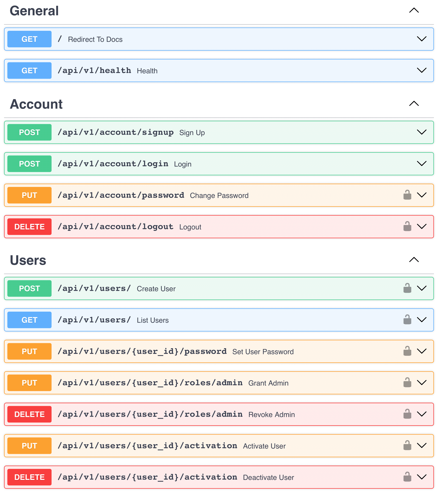

# Table of contents

1. [Overview](#overview)
2. [Architecture Principles](#architecture-principles)
    1. [Introduction](#introduction)
    2. [Layered Approach](#layered-approach)
    3. [Dependency Rule](#dependency-rule)
        1. [Note on Adapters](#note-on-adapters)
    4. [Layered Approach Continued](#layered-approach-continued)
    5. [Dependency Inversion](#dependency-inversion)
    6. [Dependency Injection](#dependency-injection)
    7. [CQRS](#cqrs)
3. [Project](#project)
    1. [Dependency Graphs](#dependency-graphs)
    2. [Structure](#structure)
    3. [Technology Stack](#technology-stack)
    4. [API](#api)
        1. [General](#general)
        2. [Account](#account-apiv1account)
        3. [Users](#users-apiv1users)
    5. [Configuration](#configuration)
        1. [Flow](#flow)
        2. [Local Development](#local-development)
        3. [Docker Deployment](#docker-deployment)
4. [Useful Resources](#useful-resources)
5. [Acknowledgements](#acknowledgements)

# Overview

📘 This FastAPI-based project and its documentation represent my interpretation of Clean Architecture and Command Query
Responsibility Segregation (CQRS) principles with subtle notes of Domain-Driven Design (DDD).
While not claiming originality or strict adherence to every aspect of these methodologies, the project demonstrates how
their key ideas can be effectively implemented in Python.
If they're new to you, refer to the [Useful Resources](#useful-resources) section.

💬 Feel free to open issues, ask questions, or submit pull requests.

⭐ If you find this project useful, please give it a star or share it!

# Architecture Principles

## Introduction

This repository may be helpful for those seeking a backend implementation in Python that is both framework-agnostic
and storage-agnostic (unlike Django).
Such flexibility can be achieved by using a web framework that doesn't impose strict software design (like FastAPI) and
applying a layered architecture patterned after the one proposed by Robert Martin, which we'll explore further.

The original explanation of the Clean Architecture concepts can be
found [here](https://blog.cleancoder.com/uncle-bob/2012/08/13/the-clean-architecture.html).
If you're still wondering why Clean Architecture matters, read the article — it only takes about 5 minutes.
In essence, it’s about making your application independent of external systems and highly testable.

<p align="center">
  
  <br><em>Figure 1: <b>Robert Martin's</b> Clean Architecture Diagram</em>
</p>

> "A computer program is a detailed description of the **policy** by which inputs are transformed into outputs."
>
> — Robert Martin

The most abstract policies define core business rules, while the least abstract ones handle I/O operations.
Being closer to implementation details, less abstract policies are more likely to change.
A layer represents a collection of components expressing policies at the same level of abstraction.

The concentric circles represent boundaries between different layers.
The meaning of the arrows in the diagram will be discussed [later](#dependency-rule).
For now, we will focus on the purpose of the layers.

## Layered Approach

 **Domain Layer**

- The core of the application, containing **entities**, **value objects**, and **domain services** that encapsulate
  critical business rules — fundamental principles or constraints that define how the business operates and delivers
  value.
  In some cases, these rules can be seen as mechanisms that create the product's value independently of its
  software implementation.
  Changing them often means changing the business itself.
- It establishes a **ubiquitous language** — a consistent terminology shared across the application and domain.
  This is the language you can speak with managers.
- It's the most stable and independent part of the application.

> [!NOTE]
> The Domain layer may also include **aggregates** (groups of entities that must change together as a single unit,
> defining the boundaries of transactional consistency) and **repository interfaces** (abstractions for manipulating
> aggregates).
> While these concepts aren't implemented in the project's codebase, understanding them can deepen your knowledge of
> DDD.

 **Application Layer**

- This layer contains applied business logic, defining _**use cases**_ — high-level abstractions that bridge the domain
  layer with its practical implementation, orchestrating business logic to achieve specific goals.
- Its core component is the **interactor**, representing an individual step within a use case.
- To access external systems, interactors use **interfaces (ports)**, which abstract infrastructure details.
- Interactors can be grouped into an **application service**, combining actions sharing a close context.

> [!NOTE]
> Domain and Application layers may import libraries that extend the language's capabilities or provide general-purpose
> utilities (e.g., for numerical computations, timezone management, or object modeling). However, they should avoid any
> ties to specific frameworks, databases, or external systems.

 **Infrastructure Layer**

- This layer is responsible for _**adapting**_ the application to external systems.
- It provides **implementations (adapters)** for the interfaces (ports) defined in the Application layer,
  allowing the application to interact with external systems like databases, APIs, and file systems while keeping the
  business logic decoupled from them.
- Related adapter logic can also be grouped into an **infrastructure service**.

> [!IMPORTANT]
> - Clean Architecture doesn't prescribe any particular number of layers.
    The key is to follow the Dependency Rule, which is explained in the next section.

## Dependency Rule

A dependency occurs when one software component relies on another to operate.
If you were to split all blocks of code into separate modules, dependencies would manifest as imports between those
modules. Typically, dependencies are graphically depicted in UML style in such a way that

> [!IMPORTANT]
> - `A -> B` (**A points to B**) means **A depends on B**.

The key principle of Clean Architecture is the **Dependency Rule**.
This rule states that **more abstract software components must not depend on more concrete ones.**
In other words, dependencies must never point outwards within the application's boundaries.

> [!IMPORTANT]
> - Components within the same layer can depend **on each other.** For example, components in the Infrastructure layer
    can interact with one another without crossing into other layers.
>
> - Components in any outer layer can depend on components in **any** inner layer, not necessarily the one closest to
    them. For example, components in the Presentation layer can directly depend on the Domain layer, bypassing the
    Application and Infrastructure layers.
>
> - However, avoid letting business logic leak into peripheral details, such as raising business-specific exceptions in
    the Infrastructure layer or declaring domain rules outside the Domain layer.
>
> - In specific cases where database constraints enforce business rules, the Infrastructure layer may raise
    domain-specific exceptions, such as `UsernameAlreadyExists` for a `UNIQUE CONSTRAINT` violation.
    Handling these exceptions in the Application layer ensures that any business logic implemented in adapters remains
    under control.
>
> - Beware of introducing elements in an inner layer tailored specifically to the needs of an outer layer.
    For example, you might be tempted to place something in the Application layer that exists solely to support a
    specific piece of infrastructure.
    At first glance, based on imports, it might seem that the Dependency Rule isn't violated. However, in reality,
    you've broken the core idea of the rule by embedding infrastructure concerns (more concrete) into the business logic
    (more abstract).

### Note on Adapters

In my opinion, the diagram by R. Martin in Figure 1 can, without significant loss, be replaced by a more concise and
pragmatic one — where the adapter layer serves as a bridge, depending both on the internal layers of the application and
external components.
This adjustment implies **reversing** the arrow from the blue layer to the green layer in R. Martin's diagram.

The proposed solution is a **trade-off**.
It doesn't strictly follow R. Martin's original concept but avoids introducing excessive abstractions with
implementations outside the application's boundaries.
Pursuing purity on the outermost layer is more likely to result in overengineering than in practical gains.

My approach retains nearly all the advantages of Clean Architecture while simplifying real-world development.
When needed, adapters can be removed along with the external components they're written for, which isn't a
significant issue.

Let's agree, for this project, that Dependency Rule **does not apply to adapters**.

<div style="display: grid; grid-template-columns: repeat(auto-fit, minmax(400px, 1fr)); gap: 10px; justify-items: center;">
  
  
</div>
<p align="center" style="font-size: 14px;">
  <em>Figure 2: <b>My Pragmatic Interpretation</b> of Clean Architecture Diagram<br>
  (original and alternative representation)
  </em>
</p>

## Layered Approach Continued

 **Presentation Layer**

> [!NOTE]
> In the original diagram, the Presentation layer isn't explicitly distinguished and is instead included within the
> Interface Adapters layer. I chose to introduce it as a separate layer, marked in blue, as I see it as even more
> external compared to typical adapters.

- This layer handles external requests and includes **controllers** that validate inputs and pass them to the
  interactors in the Application layer. The more abstract layers of the program assume that request data is already
  validated, allowing them to focus solely on their core logic.
- Controllers must be as thin as possible, containing no logic beyond basic input validation and routing. Their
  role is to act as an intermediary between the application and external systems (e.g., FastAPI).

> [!IMPORTANT]
> - **_Basic_** validation, like checking whether the structure of the incoming request matches the structure of the
    defined request model (e.g., type safety and required fields) should be performed by controllers at this layer,
    while **_business rule_** validation (e.g., ensuring the email domain is allowed, verifying the uniqueness of
    username, or checking if a user meets the required age) belongs to the Domain or Application layer.
> - Business rule validation often involves relationships between fields, such as ensuring that a discount applies only
    within a specific date range or a promotion code is valid for orders above a certain total.
> - Pydantic is unsuitable for business rule validation. Its parsing and serialization features are irrelevant in this
    context, and while it might appear helpful for validation, it lacks the capabilities to handle complex relationships
    that may arise in Domain or Application layers.

 **External Layer**

> [!NOTE]
> In the original diagram, the external components are included in the blue layer (Frameworks & Drivers).
> I've marked them in gray to clearly distinguish them from the layers within the application's boundaries.

- This layer represents fully external components such as web frameworks (e.g. FastAPI itself), databases, third-party
  APIs, and other services.
- These components operate outside the application’s core logic and can be easily replaced or modified without affecting
  the business rules, as they interact with the application only through the Presentation and Infrastructure layers.

<p align="center">
  
  <br><em>Figure 3: Basic Dependency Graph</em>
</p>

## Dependency Inversion

The **dependency inversion** technique enables reversing dependencies **by introducing an interface** between
components, allowing the inner layer to communicate with the outer layer while adhering to the Dependency Rule.

<p align="center">
  
  <br><em>Figure 4: <b>Corrupted</b> Dependency</em>
</p>

In this example, the Application component depends directly on the Infrastructure component, violating the Dependency
Rule.
This creates "corrupted" dependencies, where changes in the Infrastructure layer can propagate to and unintentionally
affect the Application layer.

<p align="center">
  
  <br><em>Figure 5: <b>Correct</b> Dependency</em>
</p>

In the correct design, the Application layer component depends on an **abstraction (port)**, and the Infrastructure
layer component **implements** the corresponding interface.
This makes the Infrastructure component an adapter for the port, effectively turning it into a plugin for the
Application layer.
Such a design adheres to the **Dependency Inversion Principle (DIP)**, minimizing the impact of infrastructure changes
on the core business logic.

## Dependency Injection

The idea behind **Dependency Injection** is that a component shouldn't create the dependencies it needs but rather
receive them.
From this definition, it's clear that one common way to implement DI is by passing dependencies as arguments to the
`__init__` method or functions.

But how exactly should these dependencies be passed?

**DI frameworks** offer an elegant solution by automatically creating the necessary objects (while managing their
**lifecycle**) and injecting them where needed.
This makes the process of dependency injection much cleaner and easier to manage.

<p align="center">
  
  <br><em>Figure 6: <b>Correct</b> Dependency <b>with DI</b></em>
</p>

FastAPI provides a built-in **DI mechanism** called [Depends](https://fastapi.tiangolo.com/tutorial/dependencies/),
which tends to leak into different layers of the application. This creates tight coupling to FastAPI, violating the
principles of Clean Architecture, where the web framework belongs to the outermost layer and should remain easily
replaceable.

Refactoring the codebase to remove `Depends` when switching frameworks can be unnecessarily costly. It also has [other
limitations](https://dishka.readthedocs.io/en/stable/alternatives.html#why-not-fastapi) that are beyond the scope of
this README. Personally, I prefer [**Dishka**](https://dishka.readthedocs.io/en/stable/index.html) — a solution that
avoids these issues and remains framework-agnostic.

## CQRS

The project implements Command Query Responsibility Segregation (**CQRS**) — a pattern that separates read and write
operations into distinct paths.

- **Commands** (via interactors) handle write operations and business-critical reads using command gateways that work
  with entities and value objects.
- **Queries** are implemented through query services (similar contract to interactors) that use query gateways to fetch
  data optimized for presentation as query models.

This separation enables:

- Efficient read operations through specialized query gates, avoiding loading complete entity models.
- Performance optimization by tailoring data retrieval to specific view requirements.
- Flexibility to combine data from multiple models in read operations with minimal field selection.

# Project

## Dependency Graphs

<details>
  <summary>Application Controller - Interactor</summary>

  <p align="center">
  
  <br><em>Figure 7: Application Controller - Interactor</em>
  </p>

In the presentation layer, a Pydantic model appears when working with FastAPI and detailed information needs to be
displayed in OpenAPI documentation.
You might also find it convenient to validate certain fields using Pydantic;
however, be cautious to avoid leaking business rules into the presentation layer.

For request data, a plain `dataclass` is often sufficient.
Unlike lighter alternatives, it provides attribute access, which is more convenient for working in the application
layer.
However, such access is unnecessary for data returned to the client, where a `TypedDict` is sufficient (it's
approximately twice as fast to create as a dataclass with slots, with comparable access times).

</details>

<details>
  <summary>Application Interactor</summary>

  <p align="center">
  
  <br><em>Figure 8: Application Interactor</em>
  </p>

</details>

<details>
  <summary>Application Interactor - Adapter</summary>

  <p align="center">
  
  <br><em>Figure 9: Application Interactor - Adapter</em>
  </p>

</details>

<details>
  <summary>Domain - Adapter</summary>

  <p align="center">
  
  <br><em>Figure 10: Domain - Adapter</em>
  </p>

</details>

<details>
  <summary>Infrastructure Controller - Handler</summary>
  <p align="center">
  
  <br><em>Figure 11: Infrastructure Controller - Handler</em>
  </p>

An infrastructure handler may be required as a temporary solution in cases where a separate context exists but isn't
physically separated into a distinct domain (e.g., not implemented as a standalone module within a monolithic
application).
In such cases, the handler operates as an application-level interactor but resides in the infrastructure layer.

Initially, I called these handlers interactors, but the community reacted very negatively to the idea of interactors in
the infrastructure layer, refusing to acknowledge that these essentially belong to another context.

In this application, such handlers include those managing user accounts, such as registration, login, and logout.

</details>

<details>
  <summary>Infrastructure Handler</summary>
  <p align="center">
  
  <br><em>Figure 12: Infrastructure Handler</em>
  </p>

Ports in infrastructure are not commonly seen — typically, only concrete implementations are present.
However, in this project, since we have a separate layer of adapters (presentation) located outside the infrastructure,
ports are necessary to comply with the dependency rule.

</details>

<details>

**Identity Provider (IdP)** abstracts authentication details, linking the main business context with the authentication
context. In this example, the authentication context is not physically separated, making it an infrastructure detail.
However, it can potentially evolve into a separate domain.

  <summary>Identity Provider</summary>
  <p align="center">
  
  <br><em>Figure 13: Identity Provider</em>
  </p>

Normally, IdP is expected to provide all information about current user.
However, in this project, since roles are not stored in sessions or tokens, retrieving them in main context was more
natural.

</details>

## Structure

```
.
├── config.toml                              # primary config file
├── .env.example                             # example env vars for Docker/local dev
│
├── Makefile                                 # shortcuts for setup and common tasks
├── scripts/...                              # helper scripts
│
├── pyproject.toml                           # tooling and environment config (uv)
├── ...
└── src/
    └── app/
        ├── run.py                           # app entry point
        │
        ├── application/...                  # application layer
        │   ├── common/                      # common layer objects
        │   │   ├── authorization/...        # authorization logic
        │   │   └── ...                      # ports, exceptions, etc.
        │   │
        │   ├── commands/                    # write operations, business-critical reads
        │   │   ├── admin_create_user.py     # interactor
        │   │   └── ...                      # other interactors
        │   │
        │   └── queries/                     # optimized read operations
        │       ├── admin_list_users.py      # query service
        │       └── ...                      # other query services
        │
        ├── domain/                          # domain layer
        │   ├── entities/...                 # key business logic actors
        │   │   ├── base/...                 # base declarations
        │   │   └── user/...                 # user entities and value objects
        │   │
        │   ├── services/...                 # domain layer services
        │   └── ...                          # ports, exceptions, etc.
        │
        ├── infrastructure/...               # infrastructure layer
        │   ├── auth_context/...             # auth context (session-based)
        │   │   ├── common/...               # common context objects
        │   │   │
        │   │   ├── log_in.py                # handler
        │   │   └── ...                      # other handlers
        │   │
        │   └── ...                          # adapters, exceptions, etc.
        │
        ├── presentation/...                 # presentation layer
        │   ├── common/...                   # common layer objects
        │   │
        │   └── http_controllers/            # controllers (http)
        │       ├── user_change_password.py  # controller
        │       └── ...                      # other controllers
        │
        └── setup/
            ├── app_factory.py               # app builder
            ├── config/...                   # app settings
            └── ioc/...                      # dependency injection setup
```

## Technology Stack

- **Python**: `3.12`
- **Core**: `alembic`, `alembic-postgresql-enum`, `bcrypt`, `dishka`, `fastapi`, `orjson`, `psycopg3[binary]`,
  `pydantic[email]`, `pyjwt[crypto]`, `rtoml`, `sqlalchemy[mypy]`, `uuid6`, `uvicorn`, `uvloop`
- **Testing**: `coverage`, `pytest`, `pytest-asyncio`
- **Development**: `bandit`, `black`, `isort`, `line-profiler`, `mypy`, `pre-commit`, `pylint`, `ruff`

## API

<p align="center">
  
  <br><em>Figure 14: Handlers</em>
</p>

### General

- `/`: Open to **everyone**.
    - Redirects to Swagger Documentation.
- `/api/v1/`: Open to **everyone**.
    - Returns `200 OK` if the API is alive.

### Account (`/api/v1/account`)

- `/signup`: Open to **everyone**.
    - Registers a new user with validation and uniqueness checks.
    - Passwords are peppered, salted, and stored as hashes.
    - A logged-in user cannot sign up until the session expires or is terminated.
- `/login`: Open to **everyone**.
    - Authenticates registered user, sets a JWT access token with a session ID in cookies, and creates a session.
    - A logged-in user cannot log in again until the session expires or is terminated.
    - Authentication renews automatically when accessing protected routes before expiration.
    - If the JWT is invalid, expired, or the session is terminated, the user loses authentication. [^1]
- `/logout`: Open to **authenticated users**.
    - Logs the user out by deleting the JWT access token from cookies and removing the session from the database.

### Users (`/api/v1/users`)

- `/` (POST): Open to **admins**.
    - Creates a new user, including admins, if the username is unique.
    - Only super admins can create new admins.
- `/` (GET): Open to **admins**.
    - Retrieves a paginated list of existing users with relevant information.
- `/inactivate`: Open to **admins**.
    - Soft-deletes an existing user, making that user inactive.
    - Also deletes the user's sessions.
    - Only super admins can inactivate other admins.
- `/reactivate`: Open to **admins**.
    - Restores a previously soft-deleted user.
    - Only super admins can reactivate other admins.
- `/grant`: Open to super **admins**.
    - Grants admin rights to a specified user.
- `/revoke`: Open to super **admins**.
    - Revokes admin rights from a specified user.
- `/change_password`: Open to **authenticated users**.
    - Changes the user's password.
    - The current user can change their own password.
    - Admins can change passwords of subordinate users.

> [!NOTE]
> - The initial admin privileges must be granted manually (e.g., directly in the database), though the user
    account itself can be created through the API.

## Configuration

### Flow

> [!WARNING]
> - This part of documentation is **not** related to the architecture approach.
    You are free to choose whether to use the proposed automatically generated configuration system or provide your own
    settings manually, which will require changes to the Docker configuration.
    However, **if settings are read from environment variables** instead of `config.toml`, **modifications** to the
    application's settings code **will be necessary**.

> [!WARNING]
> - ⚠️ The current project settings are **overcomplicated** and should **not** be considered a reference implementation.
> I acknowledge this issue and plan to simplify them as soon as I have time. Please keep this in mind while working with
> the configuration.

> [!IMPORTANT]
> - In the configuration flow diagram below,
    the arrows represent **the flow of data, not dependencies.**

<p align="center">
  
  <br><em>Figure 15: Configuration flow (.toml to .env)</em>
</p>

1. `config.toml`: primary config file
2. `.env`: derivative config file which Docker needs

<p align="center">
  
  <br><em>Figure 16: Configuration flow (app)</em>
</p>

### Local Development

> [!IMPORTANT]
> The following `make` commands **require** `Python >= 3.11` installed on your system.
> Feel free to take a look at [`Makefile`](Makefile), it contains many more useful commands.

1. **Set up development environment**

```shell
# sudo apt update
# sudo apt install pipx
# pipx ensurepath
# pipx install uv
uv venv
source .venv/bin/activate
# .venv\Scripts\activate  # Windows
# https://docs.astral.sh/uv/getting-started/installation/#shell-autocompletion
# uv python install 3.12
uv pip install -e '.[test,dev]'
```

2. **Configure project**

- Edit `config.toml` for primary configuration.

> [!WARNING]
> **Don't rename existing variables or remove comments** unless absolutely necessary.
> This action may invalidate scripts associated with `Makefile`.
> You can still fix them or not use `Makefile` at all.

- Generate `.env` file **in one** of the ways:
    1. **Safe** (as long as `config.toml` is correct)

       Set `POSTGRES_HOST` variable in `config.toml` to `localhost`, then:
        ```shell
        make dotenv
        ```
    2. **Convenient**:

        ```shell
        make dotenv-local
        ```
       Automatically sets correct configuration

       > Under the hood, the corresponding variable in `config.toml` becomes uncommented,
       then the script associated with `make dotenv` is called.

    3. **Manual** (use with caution):

       Rename `.env.example` to `.env` and verify all variables.

3. **Launch**

- To run only the database in Docker and use the app locally, use the following command:

    ```shell
    make up-local-db
    ```

- Then, apply the migrations:
    ```shell
    alembic upgrade head
    ```

- After applying the migrations, you can start the application locally as usual.
  The database is now set up and ready to be used by your local instance.

4. **Shutdown**

- To stop the database container, use:
    ```shell
    make down
    # or
    # docker compose down
    ```

- To permanently delete the database along with the applied migrations, run:
    ```shell
    make down-total
    # or
    # docker compose down -v
    ```

### Docker Deployment

> [!IMPORTANT]
> The following `make` commands **require** `Python >= 3.11` installed on your system.
> Feel free to take a look at [`Makefile`](Makefile), it contains many more useful commands.

1. **Configure project**

- Edit `config.toml` for primary configuration.

> [!WARNING]
> **Don't rename existing variables or remove comments** unless absolutely necessary.
> This action may invalidate scripts associated with `Makefile`.
> You can still fix them or not use `Makefile` at all.

- Generate `.env` file **in one** of the ways:
    1. **Safe** (as long as `config.toml` is correct)

       Set `POSTGRES_HOST` variable in `config.toml` to
       the name of the **Docker service** from `docker-compose.yaml`,
       then:
        ```shell
        make dotenv
        ```
    2. **Convenient**:

        ```shell
        make dotenv-docker
        ```
       Automatically sets correct configuration

       > Under the hood, the corresponding variable in `config.toml` becomes uncommented,
       then the script associated with `make dotenv` is called.

    3. **Manual** (use with caution):

       Rename `.env.example` to `.env` and verify all variables.

2. **Launch**

- **Choose one** of the following commands:

    - ```shell
      make up
      # to run in detached mode
      # or
      # docker compose up --build -d
      ```

    - ```shell
      make up-echo
      # to run in non-detached mode
      # or
      # docker compose up --build
      ```

3. **Shutdown**

- To stop the containers, use:
    ```shell
    make down
    # or
    # docker compose down
    ```

- To completely remove the containers and permanently delete the database, run:
    ```shell
    make down-total
    # or
    # docker compose down -v
    ```

# Useful Resources

## Layered Architecture

- [Robert C. Martin. Clean Architecture: A Craftsman's Guide to Software Structure and Design. 2017](https://www.amazon.com/Clean-Architecture-Craftsmans-Software-Structure/dp/0134494164)

- [Alistair Cockburn. Hexagonal Architecture Explained. 2024](https://www.amazon.com/Hexagonal-Architecture-Explained-Alistair-Cockburn-ebook/dp/B0D4JQJ8KD)
  (introduced in 2005)

## Domain-Driven Design

- [Vlad Khononov. Learning Domain-Driven Design: Aligning Software Architecture and Business Strategy. 2021](https://www.amazon.com/Learning-Domain-Driven-Design-Aligning-Architecture/dp/1098100131)

- [Vaughn Vernon. Implementing Domain-Driven Design. 2013](https://www.amazon.com/Implementing-Domain-Driven-Design-Vaughn-Vernon/dp/0321834577)

- [Eric Evans. Domain-Driven Design: Tackling Complexity in the Heart of Software. 2003](https://www.amazon.com/Domain-Driven-Design-Tackling-Complexity-Software/dp/0321125215)

- [Martin Fowler. Patterns of Enterprise Application Architecture. 2002](https://www.amazon.com/Patterns-Enterprise-Application-Architecture-Martin/dp/0321127420)

# Acknowledgements

I would like to express my sincere gratitude to the following individuals for their valuable ideas and support in
satisfying my curiosity throughout the development of this project:

- [igoryuha](https://github.com/igoryuha)
- [tishka17](https://github.com/tishka17)
- [chessenjoyer17](https://github.com/chessenjoyer17)
- [PlzTrustMe](https://github.com/PlzTrustMe)
- [Krak3nDev](https://github.com/Krak3nDev)
- [Ivankirpichnikov](https://github.com/Ivankirpichnikov)
- [nkhitrov](https://github.com/nkhitrov)
- [ApostolFet](https://github.com/ApostolFet)
- Lancetnik
- Sehat1137
- Maclovi

I would also like to thank all the other participants of the ASGI Community Telegram chat and
⚗️ Reagento (adaptix/dishka) [Telegram chat](https://t.me/reagento_ru) for their insightful discussions and shared
knowledge.

However, I must warn that, despite the high professionalism of some participants, the overall communication culture in
the ASGI Community chat is extremely low. Therefore, joining it is at your own risk.

# Todo

- [x] set up CI
- [ ] simplify settings
- [ ] increase test coverage
- [ ] explain the code

[^1]: Session and token share the same expiry time, avoiding database reads if the token is expired.
